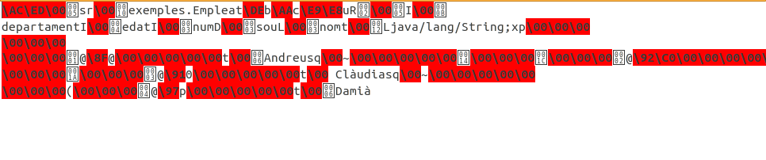

Accés a Dades

# 3.- Seriació d'objectes

Seriació d'objectes

La tècnica de la **seriació** és segurament la més senzilla de totes, però
també a la vegada la més problemàtica. Java, i per tant també Kotlin, disposa
d’un sistema genèric de seriació de qualsevol objecte, un sistema **recursiu**
que es repeteix per cada objecte contingut a la instància que s’està seriant.
Aquest procés para en arribar als tipus primitius, els quals es guarden com
una sèrie de bytes. A banda dels tipus primitius, Java serialitza també molta
informació addicional o metadades específiques de cada classe (el nom de les
classe, els noms dels atributs i molta més informació addicional). Gràcies a
les metadades es fa possible automatitzar la seriació de forma genèrica **amb
garanties de recuperar un objecte tal com es va guardar**.

Lamentablement, **aquest és un procediment específic de Java**. És a dir, no
és possible recuperar els objectes seriats des de Java utilitzant un altre
llenguatge. D’altra banda, el fet de guardar metadades pot arribar a comportar
també problemes, encara que utilitzem sempre el llenguatge Java. La
modificació d’una classe pot fer variar les seues metadades. Aquestes
variacions poden donar problemes de recuperació d’instàncies que hagen estat
guardades amb algunes versions anteriors a la modificació, impedint que
l’objecte puga ser recuperat.

Aquestes consideracions fa que no siga pràctica aquesta tècnica per guardar
objectes de forma més o menys permanent. En canvi, la seua senzillesa la fa
una perfecta candidata per a l’emmagatzematge temporal, per exemple dins de la
mateixa sessió.

Per a que un objecte puga ser seriat cal que la seua classe i tot el seu
contingut implementen la interfície **Serializable**. Es tracta d’una
interfície sense mètodes, perquè l’únic objectiu de la interfície és actuar de
marcador per indicar a la màquina virtual quines classes es poden seriar i
quines no.

Totes les classes equivalents als tipus bàsics ja implementen Serializable.
També implementen aquesta interfície la classe String i tots els contenidors i
els objectes Array. La seriació de col·leccions depèn en últim terme dels
elements continguts. Si aquestos són seriables, la col·lecció també ho serà.

En cas que la classe de l’objecte que s’intente seriar, o les d’algun dels
objectes que continga, no implementaren la interfície Serializable, es
llançaria una excepció de tipus **NotSerializableException** , impedint
l’emmagatzematge.

Els Streams **ObjectInputStream** i **ObjectOutputStream** són decoradors que
afegeixen a qualsevol altre Stream la capacitat de seriar qualsevol objecte
Serializable. El stream d'eixida disposarà del mètode **writeObject**. i el
stream d’entrada, el mètode de lectura **readObject**.

El mètode readObject només permet recuperar instàncies que siguen de la
mateixa classe que la que es va guardar. En cas contrari, es llançaria una
excepció de tipus **ClassCastExeception**. A més, cal que l’aplicació dispose
del codi compilat de la classe; si no fóra així, l’excepció llançada seria
**ClassNotFoundException**.

Exemple

Ens recolzarem en un exemple utilitzat en els anteriors punts, en els
empleats. Ara anem a suposar que els empleats són objectes, i intentarem
guardar aquestos objectes en un fitxer amb una seriació.

El primer pas serà construir la classe **Empleat** , que contindrà la mateixa
informació que en els altres apartats: número d'empleat, nom, departament,
edat i sou.

    
    
    package exemples
    
    import java.io.Serializable
    
    class Empleat (var num: Int, var nom: String, var departament: Int, var edat: Int, var sou: Double): Serializable

Anem a intentar construir el fitxer de dades amb els objectes guardats. El
flux de dades serà un **ObjectOutputStream** per a poder escriure
(**writeObject**). I observeu com s'ha de recolzar en un OutputStream, que en
aquest cas serà d'un fitxer, és a dir un **FileOutputStream**. A cada iteració
del bucle senzillament construirem un objecte de la classe **Empleat** i
l'escriurem al fitxer. Copieu el següent codi en un fitxer Kotlin anomenat
**Exemple_3_3_1_GuardarObjectes.kt**

    
    
    import java.io.ObjectOutputStream
    import java.io.FileOutputStream
    
    fun main(args: Array<String>) {
    	val f = ObjectOutputStream(FileOutputStream("Empleats.obj"))
    
    	val noms = arrayOf("Andreu", "Bernat", "Clàudia", "Damià")
    	val departaments = arrayOf(10, 20, 10, 10)
    	val edats = arrayOf(32, 28, 26, 40)
    	val sous = arrayOf(1000.0, 1200.0, 1100.0, 1500.0)
    
    	for (i in 0..3){
    		val e = Empleat (i + 1, noms[i], departaments[i], edats[i], sous[i])
    		f.writeObject(e)
    	}
    
    	f.close();
    }

**Nota**

El fitxer creat, **Empleats.obj** , evidentment no és de text. Tanmateix si
l'obrim amb un editor de text podrem veure alguna cosa.

  * La primera qüestió és que es guarda el nom de la classe amb el nom del paquet davant. **exemples.Empleat** és realment el nom de la classe creada.
  * Es guarden també els noms dels camps. Tot això són les metadades que havíem comentat, i que permeten la recuperació posterior dels objectes guardats
  * I després ja podem veure la informació guardada, on identifiquem els noms dels empleats

Per a llegir el fitxer creat, **Empleats.obj** , utilitzarem el
**ObjectInputStream** per a poder fer **readObject**. S'ha de basar en un
InputStream, que en aquest cas serà un **FileInputStream**.

Lamentablement el mètode **available()** no funcionarà correctament, i no ens
dirà realment els bytes que queden per llegir.

El tractament de final de fitxer el farem capturant l'excepció (l'error)
d'haver arribat al final i intentat llegir encara: **EOFException**. La raó és
que **readObject** no torna null, a no ser que s'haja introduït aquest valor.
Per tant muntem un bucle infinit, però capturant amb **try ... catch**
l'error, que és quan tancarem el Stream. Copieu el següent codi a un fitxer
Kotlin anomenat **Exemple_3_3_2_LlegirObjectes.kt**

    
    
    package exemples
    
    import java.io.ObjectInputStream
    import java.io.FileInputStream
    import java.io.EOFException
    
    fun main(args: Array<String>) {
        val f = ObjectInputStream(FileInputStream("Empleats.obj"))
    
        try {
            while (true) {
                val e = f.readObject() as Empleat
                println("Número: " + e.num)
                println("Nom: " + e.nom)
                println("Departament: " + e.departament)
                println("Edat: " + e.edat)
                println("Sou: " + e.sou)
                println();
            }
        } catch (eof: EOFException) {
            f.close()
        }
    }

**_Nota_**

En realitat, en el fitxer es guarda, a més del nom del paquet i el nom de la
classe, l'identificador de la classe: el **serialVersionUID** , per a poder
identificar unívocament la classe. Això ens pot donar problemes si intentem
compartir la informació entre nosaltres, ja que perfectament ens pot generar
UID diferents. Per a evitar-lo podríem definir nosaltres aquest
**serialVersionUID** , i aleshores no hi haurà problemes per a compartir. Fins
i tot serviria per a poder compartir el fitxer d'objectes entre **Kotlin** i
**Java**

    
    
    package exemples
    
    import java.io.Serializable
    
    class Empleat (var num: Int,var nom: String,var departament: Int,var edat: Int,var sou: Double): Serializable {
        companion object {
            private const val serialVersionUID: Long = 1
        }
    }

Si fem aquest canvi en la classe Empleat haurem de tornar a generar el fitxer
(**Exemple_3_3_1_GuardarObjectes.kt**) abans de poder consultar-lo
(**Exemple_3_3_2_LlegirObjectes.kt**), perquè a tots els efectes seria una
classe nova.

Llicenciat sota la  [Llicència Creative Commons Reconeixement NoComercial
CompartirIgual 2.5](http://creativecommons.org/licenses/by-nc-sa/2.5/)

