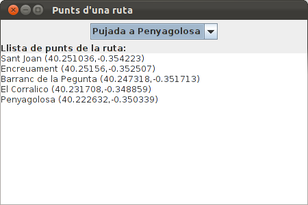
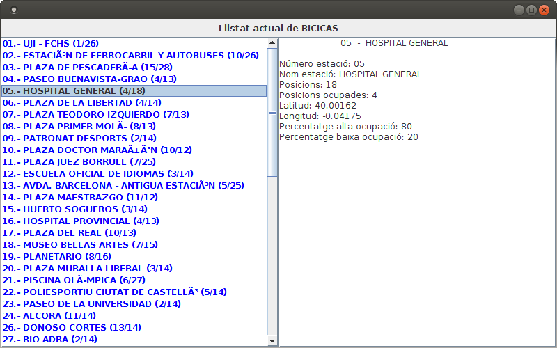

Accés a Dades

# Exercicis

## Exercici 3_1

En el projecte anomenat **Tema3** , crea't un paquet anomenat **exercicis** on
col·locarem tot el relatiu als exercicis d'aquest tema. Copia't dins del
projecte el fitxer **Rutes.dat** que us passarà el professor. En ell tenim
dades prèviament guardades que seran unes **rutes** consistents en una sèrie
de punts amb una descripció. Cada punt seran unes coordenades (com en un
mapa).

L'estructura de les dades guardades és la següent

  * nom de la ruta (string)
  * desnivell (int)
  * desnivell acumulat (int)
  * número de punts (int)
  * Per cada punt: 
    * nom (string)
    * latitud (double)
    * longitud (double)

Observa que la quarta dada és un enter amb el número de punts de la ruta.

Fes un programa (amb **fun main()**) en el fitxer Kotlin
**Ex3_1_LlegirRutesSerial.kt** que agafe les dades del fitxer (hi ha 2 rutes,
però ho heu de fer genèric per a un número indeterminat de rutes) i les traga
per pantalla amb aquest aspecte:

Ruta: Pujada a Penyagolosa  
Desnivell: 530  
Desnivell acumulat: 530  
Té 5 punts  
Punt 1: Sant Joan (40.251036,-0.354223)  
Punt 2: Encreuament (40.25156,-0.352507)  
Punt 3: Barranc de la Pegunta (40.247318,-0.351713)  
Punt 4: El Corralico (40.231708,-0.348859)  
Punt 5: Penyagolosa (40.222632,-0.350339)  
  
Ruta: La Magdalena  
Desnivell: 51  
Desnivell acumulat: 84  
Té 7 punts  
Punt 1: Primer Molí (39.99385,-0.032941)  
Punt 2: Segon Molí (39.99628,-0.029427)  
Punt 3: Caminàs (40.00513,-0.022569)  
Punt 4: Riu Sec (40.006765,-0.02237)  
Punt 5: Sant Roc (40.017906,-0.02289)  
Punt 6: Explanada (40.034048,-0.00633)  
Punt 7: La Magdalena (40.034519,-0.005856)

## Exercici 3_2

****Construeix les següents classes:

**Coordenades** , que derivarà de **Serializable** (i que és convenient posar-
li el número de versió per defecte: **private const val serialVersionUID: Long
= 1**). Podeu consultar la classe Ruta que us passe per veure la manera de
derivar de Serializable i posar-li número de sèrie.

Contindrà:

  * **latitud** (double)
  * **longitud** (double)

No caldrà contructor, ni getters ni setters, ja que Kotlin els genera
automàticament  

* * *

**PuntGeo** , que derivarà de **Serializable** (i que és convenient posar-li
el número de versió per defecte: **private const val serialVersionUID: Long =
1**). Podeu consultar la classe Ruta que us passe per veure la manera de
derivar de Serializable i posar-li número de sèrie.

Contindrà:

  * **nom** (String)
  * **coord** (Coordenades)

* * *

**Ruta** . Aquesta classe us la passarà el professor.

També implementa **Serializable** i conté:

  * **nom** (String)****
  * **desnivell** (int)
  * **desnivellAcumulat** (int)
  * **llistaDePunts** : un ArrayList de PuntGeo

Observa com per a més comoditat té els mètodes:

  * **addPunt(PuntGeo)** , que afegirà un nou PuntGeo a la llista
  * **getPunt(int)** , al qual se li passa l'índex del punt que es vol i torna tot aquest punt
  * **getPuntNom(int)** , al qual se li passa l'índex del punt que es vol i tornarà el seu nom
  * **getPuntLatitud(int)******, al qual se li passa l'índex del punt que es vol i tornarà la seua latitud
  * **getPuntLongitud(int)** , al qual se li passa l'índex del punt que es vol i tornarà la seua longitud
  * **size()** , que ens dóna el número de punts guardats en la llista.

L'únic que has de fer en aquesta classe és:

  * Fes un mètode nou en la classe **Ruta** anomenat **mostraRuta()** , que mostre el contingut de la ruta amb aquest aspecte:

Ruta: Pujada a Penyagolosa  
Desnivell: 530  
Desnivell Acumulat: 530  
Té 5 punts  
Punt 1: Sant Joan (40.251036,-0.354223)  
Punt 2: Encreuament (40.25156,-0.352507)  
Punt 3: Barranc de la Pegunta (40.247318,-0.351713)  
Punt 4: El Corralico (40.231708,-0.348859)  
Punt 5: Penyagolosa (40.222632,-0.350339)

* * *

En un fitxer Kotlin anomenat **Ex3_2_PassarRutesSerialObj.kt** , fes el
programa que passe del fitxe **Rutes.dat** al fitxer **Rutes.obj**. És a dir,
has d'anar agafant la informació del fitxer **Rutes.dat** , guardar la
informació en un objecte **Ruta** , visualitzar la seua informació amb
**mostraRuta()** i per últim guardar la informació de l'objecte en un fitxer
anomenat **Rutes.obj**. I això fins el final de fitxer (hi ha 2 rutes)

En un fitxer Kotlin anomenat **Ex3_2_LlegirRutesObj.kt** , llig les rutes
guardades en el fitxer **Rutes.obj** i mostra-les per pantalla utilitzant el
mètode **mostraRuta()****  
**

## Exercici 3_3

Fes un programa en el fitxer **Ex3_3_PassarRutesObjXML.kt** (amb main) que
passe el fitxer **Rutes.obj** a un fitxer XML anomenat **Rutes.xml** amb
aquest aspecte. Els punts suspensius indiquen que hi ha més d'un punt en cada
ruta, i que hi ha més d'una ruta

<rutes>

<ruta>

<nom>Pujada a Penyagolosa</nom>

<desnivell>530</desnivell>

<desnivellAcumulat>530</desnivellAcumulat>

<punts>

<punt num="1">

<nom>Sant Joan</nom>

<latitud>...</latitud>

<longitud>...</longitud>

</punt>

...

</punts>

</ruta>

...

</rutes>

## Exercici 3_4

Fer una aplicació gràfica que llegirà el fitxer **Rutes.xml** per a que
apareguen els noms de les rutes en un JComboBox. Quan se seleccione una, ha
d'aparèixer la llista de punts (nom, latitud i longitud) en un JTextArea.
L'aspecte podria ser el següent:

Hi ha dos mètodes per a saber quin és l'element seleccionat del **JComboBox**
:

  * **getSelectedItem()** torna un String amb l'element seleccionat
  * **getSelectedIndex()** torna un enter amb el número d'ordre de l'element seleccionat (0 per al primer; 1 per al segon; ...)

Observeu com en aquest cas ens convé **getSelectedIndex()** , ja que el número
d'ordre de l'element seleccionat serà el mateix que el número d'ordre de la
ruta que busquem en el NodeList **doc.getElementsByTagName("ruta")**

L'esquelet del programa seria aquest. Copieu-lo en un fitxer Kotlin anomenat
**Ex3_4_VisRutesXML.kt** :

    
    
    import javax.swing.*
    import java.awt.*
    import org.w3c.dom.Document
    import org.w3c.dom.Element
    import javax.xml.parsers.DocumentBuilderFactory
    
    
    class Finestra : JFrame() {
    	
    	init {
    		var doc: Document
    		// sentències per a omplir doc
    		
    		defaultCloseOperation = JFrame.EXIT_ON_CLOSE
    		setTitle("Punts d'una ruta")
    		setSize(400, 300)
    		setLayout(BorderLayout())
    		
    		val panell1 = JPanel(FlowLayout())
    		val panell2 = JPanel(BorderLayout())
    		add(panell1,BorderLayout.NORTH)
    		add(panell2,BorderLayout.CENTER)
    		
    		val llistaRutes = arrayListOf<String>()
    		// sentències per a omplir l'ArrayList anterior amb el nom de les rutes
    		
    		val combo = JComboBox(llistaRutes.toArray())
    		panell1.add(combo)
    		
    		panell2.add(JLabel("Llista de punts de la ruta:"),BorderLayout.NORTH)
    		val area = JTextArea()
    		panell2.add(area)
    		
    		combo.addActionListener{
    			// accions quan s'ha seleccionat un element del combobox,
    			// i que han de consistir en omplir el JTextArea
    			
    		}
    	}
    }
    
    fun main(args: Array<String>) {
    	EventQueue.invokeLater {
    		Finestra().isVisible = true
    	}
    }
    

## Exercici 3_5

Fer un programa en el fitxer Kotlin **Ex3_5_PassarRutesObjJSON.kt** que passe
el fitxer **Rutes.obj** a un fitxer JSON **Rutes.json** amb aquest aspecte:

    
    
    {
      "rutes": [
        {
          "nom": "Pujada a Penyagolosa",   
          "desnivell": 530,
          "desnivellAcumulat": 530,
          "llistaDePunts": [
            {
              "nom": "Sant Joan",  
              "coord": {
                "latitud": 40.251036,
                "longitud": -0.354223
              }
            },
            ...  
           ]
        },
        ...  
       ]  
    }

Com que ja tenim creades les classes **Ruta** , **PuntGeo** i **Coord** , el
més còmode serà utilitzar **Moshi**. Tan sols ens farà falta una classe que ho
englobe tot:

    
    
    class Rutes(var rutes: MutableList<Ruta> = mutableListOf<Ruta>())

## Exercici 3_6

Replicar l'exercici 3_4, però ara llegint del fitxer **Rutes.json** , en
compte de **Rutes.xml**

Fer una aplicació gràfica que llegirà el fitxer **Rutes.json** i que aparega
el nom de les rutes en un JComboBox. Quan se seleccione una, ha d'aparèixer la
llista de punts (nom, latitud i longitud) en un JTextArea. L'aspecte podria
ser el següent:

Hi ha dos mètodes per a saber quin és l'element seleccionat del **JComboBox**
:

  * **getSelectedItem()** torna un String amb l'element seleccionat
  * **getSelectedIndex()** torna un enter amb el número d'ordre de l'element seleccionat (0 per al primer; 1 per al segon; ...)

Observeu com en aquest cas, igual que en l'exercici 3_4, ens convé
**getSelectedIndex()**.

I com que ja tenim definides les classes, ens convé utilitzar **Moshi**.

Aquest seria l'esquelet del programa. Copieu el següent codi en un fitxer
Kotlin anomenat **Ex3_6_VisRutaJSON.kt** :

    
    
    import javax.swing.*
    import java.awt.*
    import com.squareup.moshi.Moshi
    import java.io.File
    
    class FinestraJSON : JFrame() {
    
    	init {
    		var llistaRutes: ArrayList<Ruta>
    		// sentències per a omplir llistaRutes
    
    		defaultCloseOperation = JFrame.EXIT_ON_CLOSE
    		setTitle("JSON: Punts d'una ruta")
    		setSize(400, 300)
    		setLayout(BorderLayout())
    
    		val panell1 = JPanel(FlowLayout())
    		val panell2 = JPanel(BorderLayout())
    		add(panell1, BorderLayout.NORTH)
    		add(panell2, BorderLayout.CENTER)
    
    		var nomsLlistaRutes = arrayListOf<String>()
    		// sentències per a omplir l'ArrayList anterior amb el nom de les rutes
    
    		val combo = JComboBox(nomsLlistaRutes.toArray())
    		panell1.add(combo)
    
    		panell2.add(JLabel("Llista de punts de la ruta:"), BorderLayout.NORTH)
    		val area = JTextArea()
    		panell2.add(area)
    
    		combo.addActionListener {
    			// accions quan s'ha seleccionat un element del combobox,
    			// i que han de consistir en omplir el JTextArea
    
    		}
    	}
    }
    
    fun main(args: Array<String>) {
    	EventQueue.invokeLater {
    		FinestraJSON().isVisible = true
    	}
    }

## Exercici 3_7 (voluntari)

Per a practicar un poquet més, anem a fer un altre exercici per a construir un
fitxer JSON però ara amb la llibreria **org.json**

Feu un programa en el fitxer Kotlin anomenat **Ex3_7_PassarCotxesXMLJSON.kt**
,**** que haurà de passar el fitxer **cotxes.xml** al fitxer **cotxes.json**.
No tenim creades les classes dels cotxes, i per això utilitzarem la llibreria
**org.json**.

Aquest és el fitxer **cotxes.xml** :

<oferta>  
<vehiculo>  
<marca>ford</marca>  
<modelo color="gris">focus</modelo>  
<motor combustible="gasolina">duratorc 1.4</motor>  
<matricula>1234AAA</matricula>  
<kilometros>12500</kilometros>  
<precio_inicial>12000</precio_inicial>  
<precio_oferta>10000</precio_oferta>  
<extra valor="250">pintura metalizada</extra>  
<extra valor="300">llantas</extra>  
<foto>11325.jpg</foto>  
<foto>11326.jpg</foto>  
</vehiculo>  
<vehiculo>  
<marca>ford</marca>  
<modelo color="gris">focus</modelo>  
<motor combustible="diesel">duratorc 2.0</motor>  
<matricula>1235AAA</matricula>  
<kilometros>125000</kilometros>  
<precio_inicial>10000</precio_inicial>  
<precio_oferta>9000</precio_oferta>  
<extra valor="250">pintura metalizada</extra>  
<extra valor="200">spoiler trasero</extra>  
<extra valor="500">climatizador</extra>  
<foto>11327.jpg</foto>  
<foto>11328.jpg</foto>  
</vehiculo>  
</oferta>

I aquest ha de ser l'aspecte de **cotxes.json** :

{  
"oferta": {  
"vehiculos": [  
{  
"marca": "ford",  
"modelo": {  
"color": "gris",  
"nombre_modelo": "focus"  
},  
"motor": {  
"combustible": "gasolina",  
"nombre_motor": "duratorc 1.4"  
},  
"matricula": "1234AAA",  
"kilometros": "12500",  
"precio_inicial": "12000",  
"precio_oferta": "10000",  
"extra": [  
{  
"valor": "250",  
"nombre_extra": "pintura metalizada"  
},  
{  
"valor": "300",  
"nombre_extra": "llantas"  
}  
],  
"foto": [  
"11325.jpg",  
"11326.jpg"  
]  
},  
{  
"marca": "ford",  
"modelo": {  
"color": "gris",  
"nombre_modelo": "focus"  
},  
"motor": {  
"combustible": "diesel",  
"nombre_motor": "duratorc 2.0"  
},  
"matricula": "1235AAA",  
"kilometros": "125000",  
"precio_inicial": "10000",  
"precio_oferta": "9000",  
"extra": [  
{  
"valor": "250",  
"nombre_extra": "pintura metalizada"  
},  
{  
"valor": "200",  
"nombre_extra": "spoiler trasero"  
},  
{  
"valor": "500",  
"nombre_extra": "climatizador"  
}  
],  
"foto": [  
"11327.jpg",  
"11328.jpg"  
]  
}  
]  
}  
}

## Exercici 3.8 (voluntari)

Visualitzar en un programa gràfic l'estat actual de Bicicas, agafant-lo
directament de la pàgina <http://gestiona.bicicas.es/apps/apps.php>.

  * En el mètode **agafarBicicas()** farem les instruccions per agafar-lo directament d'Internet, utilitzant un **URL** , en el qual:

>   * Inicialitzarem amb la pàgina que busquem
>   * Obrirem la connexió amb el mètode **openConnection()**
>   * Després obtindrem el contingut amb el mètode **getInputStream()** , que
> com el seu nom indica serà un InputStream
>

  * En el mètode **mostrarEstacions()** introduirem les instruccions per a visualitzar les estacions, utilitzant un **JList** (el que està a la part de l'esquerra), que s'ha de construir a partir d'un **DefaultListModel**. Per anar col·locant els diferents elements del JList, els haurem d'anar afegint al **DefaultListModel** , i aniran apareixent en el JList. Intentarem mostrar el número d'estació, nom i número de bicicletes (posicions ocupades) i el total de posicions.
  * El mètode **visualitzaEstacio()** s'activa quan seleccionem un element del JList, i en ell mostrarem les propietats de l'estació seleccionada en el **TextArea** que està a la part de la dreta.

Aquest seria l'aspecte:

Aquest és l'esquelet. Copieu-lo en un fitxer Kotlin anomenat
**Ex3_8_VisBicicasJSONList.kt** :

    
    
    import javax.swing.*
    import java.awt.*
    import org.json.JSONTokener
    import org.json.JSONObject
    import org.json.JSONArray
    import java.net.URL
    import java.io.InputStreamReader
    
    class FinestraBicicas : JFrame() {
    	var estacions = JSONArray()
    	var listModel = DefaultListModel<String>()
    	var list = JList(listModel)
    	var area = JTextArea(5, 15)
    
    	init {
    
    		defaultCloseOperation = JFrame.EXIT_ON_CLOSE
    		setTitle("JSON: Vista detallada BICICAS")
    		setSize(800, 800)
    		setLayout(BorderLayout())
    
    		val panell1 = JPanel(FlowLayout())
    		val panell2 = JPanel(GridLayout(1, 2))
    		add(panell1, BorderLayout.NORTH)
    		add(panell2, BorderLayout.CENTER)
    		list.setForeground(Color.blue)
    		var scroll1 = JScrollPane(list)
    		var scroll2 = JScrollPane(area)
    		panell2.add(scroll1)
    		panell2.add(scroll2)
    
    		panell1.add(JLabel("LListat actual BICICAS"))
    
    		agafarBicicas()
    
    		mostrarEstacions()
    
    		list.addListSelectionListener() {
    			if (list.getSelectedIndex() >= 0)
    				visualitzaEstacio(list.getSelectedIndex())
    		}
    	}
    
    	fun agafarBicicas() {
    		// Instruccions per a llegir de la pàgina de Bicicas i col·locar en arrel
    		val bicicas = URL("http://gestiona.bicicas.es/apps/apps.php");
    		val arrel = (JSONTokener(bicicas.openConnection().getInputStream()).nextValue() as JSONArray).get(0) as JSONObject
    		// Instruccions per a col·locar les estacions en estacions (JsonArray)  
    
    	}
    
    	fun mostrarEstacions() {
    		// Instruccions per a introduir en el JList les estacions
    		// La manera d'anar introduint informació en el JList és a través del DefaultListModel:
    		// listModel.addElement("Linia que es vol introduir ")
      
    	}
    
    	fun visualitzaEstacio(numEst: Int) {
    		// Instruccions per a mostrar les característiques en el area, el JTextArea de la dreta anomenat area
      
    	}
    }
    
    fun main(args: Array<String>) {
    	EventQueue.invokeLater {
    		FinestraBicicas().isVisible = true
    	}
    }
    

``

Llicenciat sota la  [Llicència Creative Commons Reconeixement NoComercial
CompartirIgual 2.5](http://creativecommons.org/licenses/by-nc-sa/2.5/)

